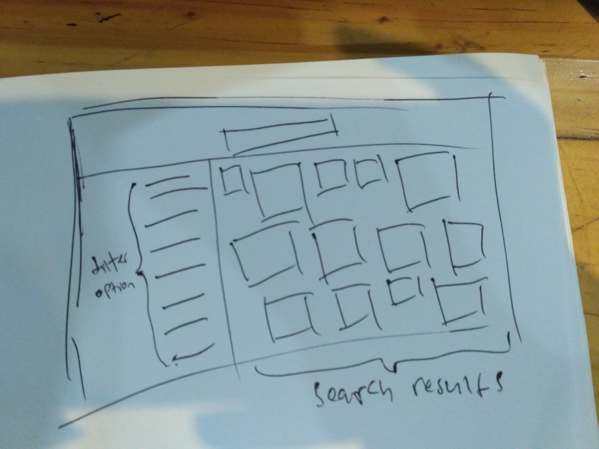
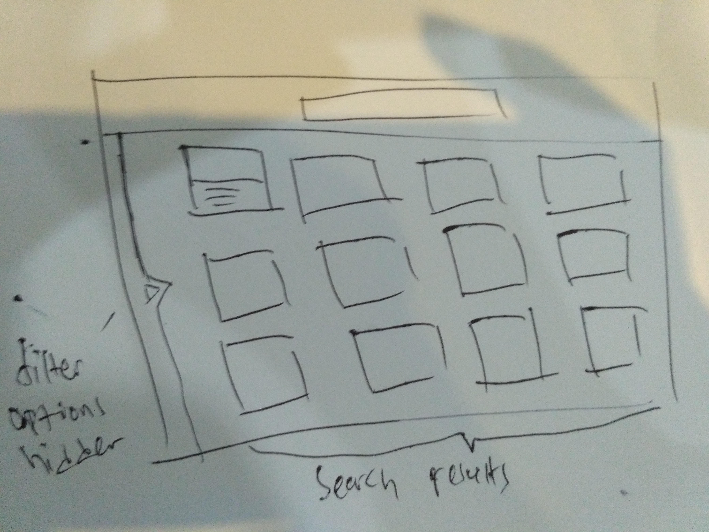
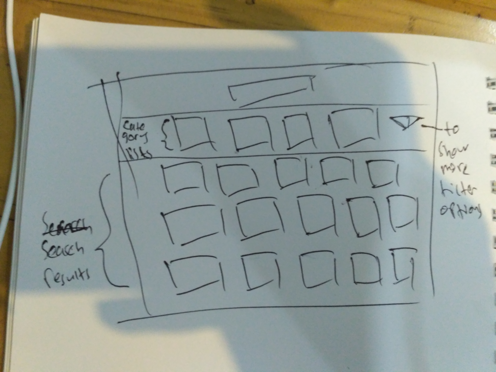
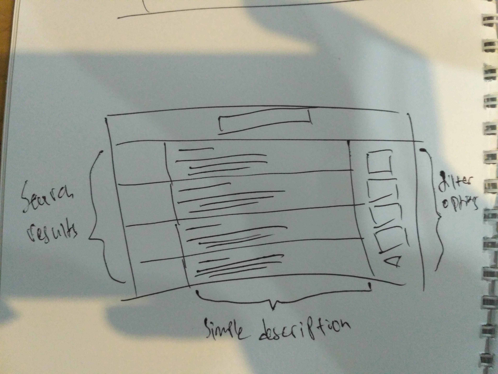
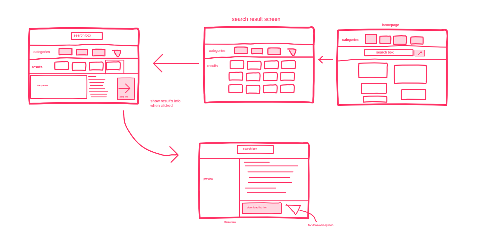

# Sketching and Prototyping
Using the information in the results of Assignment 1 for what is good and bad about the UI for designed tasks, we are going to make **Sketches** and **Prototypes**. These sketches and prototypes will lead to better design in Assignment 3. The prototypes will be then tested through a usability evaluation followed by design revision in Assignment 4.

## Part A: Sketches
Sketch at least **3 (three)** different UIs for the functions you are targeting. These three interfaces should be _dramatically different_ in terms of design directions. For example, they can be with different organizations of what functions on each screen or using a different layout of the icons, widgets, and menus on the screens. If you want, you can also incorporate non-on-screen UIs: physical buttons, gestures through motion sensors, etc.

You need **not** sketch the whole interface. It is not necessary for the sketches to have every function or every function in detail, but there should be enough to show off your general idea. **Be creative!** Draw your idea and label a few of the widgets so we can tell your intent. The goal is to have at least 3 good UIs in *interesting* ways. Sketches should be done on paper with pens and/or pencils (do not use a computer).

### 1. Scan/Photo of Sketches
#### 1.1 Original

#### 1.2 Solution 1

#### 1.3 Solution 2

#### 1.4 Solution 3

### 2. Version Differences
#### 2.1 Original
Too many filter options shown, uneven size between each results, hard to differentiate the types of each results.
#### 2.2 Solution 1
Fixing the size of each results so they are uniform, hides the filter options in a sidebar that can be hidden off screen. Also gives simple description of each result.
#### 2.3 Solution 2
Also makes the search results size the same. Show categories above search results for easier filtering. Other filter options are hidden in a menu besides it.
#### 2.4 Solution 3
Show search results in a list that have a description besides it. The category options are placed at the side instead of above.
### 3. Selected Sketch
Solution 2 for its simplicity and showing more results in a screen.

### 4. Design Rationale
When designing a UI intended for general public, the design should be simple enough for everyone to understand, especially those who are not familiar with digital technology.

## Part B: Assumptions
### 1. Hardware
A regular PC, landscape orientation with color monitor.
### 2. Users
People with various backgrounds and familiarity with computers.

## Part C: Prototypes
Invision prototype link: https://invis.io/A5R7YXT8267

